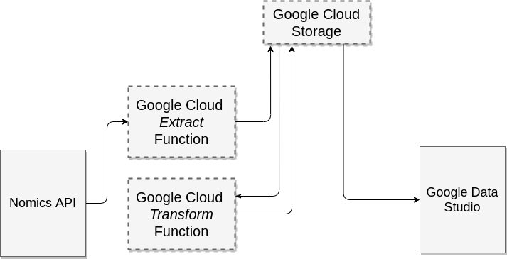

## Nomics API

### Prerequisites

Set your `NOMIC_API_KEY` environment variable:

```
export NOMIC_API_KEY="xxxxxxxxxxxxxxxxxxxxxxxxxxxxxxxx"
```

##### Weekly Coin Prices

Collect the weekly coin prices for current year:

```
make run
```

This will send a get request to the `sparkline` endpoint through the Nomics API

We will transform that data with the `transform.go` script.

The result will be in a file called `[currency]-prices.json`. All prices can be found in `coin-prices.json`.
They have also been exported to csv as well!

It should look like this:

```
[
{"currency":"BTC","price":"8221.52708250","timestamp":"2020-01-06T00:00:00Z"},
{"currency":"BTC","price":"8714.82650065","timestamp":"2020-01-13T00:00:00Z"},
{"currency":"BTC","price":"8634.12424157","timestamp":"2020-01-20T00:00:00Z"},
{"currency":"BTC","price":"9319.96695674","timestamp":"2020-01-27T00:00:00Z"},
...
{"currency":"BTC","price":"13745.47312077","timestamp":"2020-10-26T00:00:00Z"}
]
```

### Explaination

**Json Payload:** Instead of sending json payload I just pass a query string.

The keys and values of the query string:
```
key=xxxxxxxxxxxxxxxxxxxxxxxxxxxxxxxx
ids=BTC,ETH,XRP
start=2020-01-01T00%3A00%3A00Z (first day of the year)
end=2020-10-28T00%3A00%3A00Z (current date)
```

I send this as a curl GET request

```
curl -s -o price-data.json -XGET "https://api.nomics.com/v1/currencies/sparkline?key=${NOMIC_API_KEY}&ids=BTC,ETH,XRP&start=${startDate}&end=${stopDate}
```

The data is stored in a file called `price-data.json`

It is then transformed to the final form by `transform.go` and is stored in `BTC-prices.json` and `BTC-prices.csv`.
This row-like format should be ingestible by BI Tools.


Small example of graphing this data using Google Data Studio: https://datastudio.google.com/reporting/8974ac4c-0b37-4794-8199-f63c3e9ce045

The above example pulls data from my Google Cloud Storage bucket.

**Follow up questions**

> If you were to automate an ETL pipeline for this data into a Business Analytics Tool for non-technical user consumption on an on-going basis, how would you do that?


If I were to automate this ETL job, with it being a very small job, I would probably set up a google cloud function to run weekly and update the data in a google cloud storage bucket. I'd then also create another cloud function to transform the data like the transform.go file does in this repository. I would then pull from that into the Google Data Studio (GDS) page above. To the user their data is always availiable in the GDS document.

**Diagram of data flow:**



